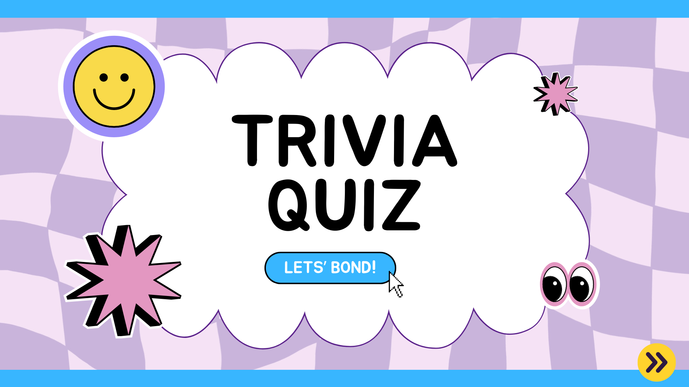

# Trivia App - Nuxt 3 Practice

In this Nuxt 3 academy, we'll have a series of practice exercises that will help you solidify what you're learning. We'll build a trivia app. All the instructions are provided below.

We'll use the [Open Trivia Database](https://opentdb.com/) for the questions.

## Guidelines
* Use the Vue 3 [Composition API](https://vuejs.org/api/composition-api-setup) throughout the project.
* Use Nuxt 3's [Data Fetching Composables](https://nuxt.com/docs/getting-started/data-fetching) for API calls.
* Use [https://opentdb.com/api_category.php](https://opentdb.com/api_category.php) to get the list of Trivia Categories.
* Use the [Open Trivia DB API](https://opentdb.com/api_config.php) to fetch the trivia questions.
* The UI does not have to super neat, but it should be presentable. See the [figma community](https://www.figma.com/community/search?resource_type=mixed&sort_by=relevancy&query=trivia&editor_type=all&price=all&creators=all) if you need some inspiration/ideas on how to layout your UI. The components you use/how you display the data is up to you.
* If you need to use a UI library, you can use [Vuetify 3](https://vuetifyjs.com/en/getting-started/installation/), but feel free to experiment with anything else, even vanilla CSS 😉.

## Phase 1 - Starter Pack
1. Create a new Nuxt 3 project.
2. The home page should:
	* Use a default layout.
	* Display all the Trivia categories a user can choose.
